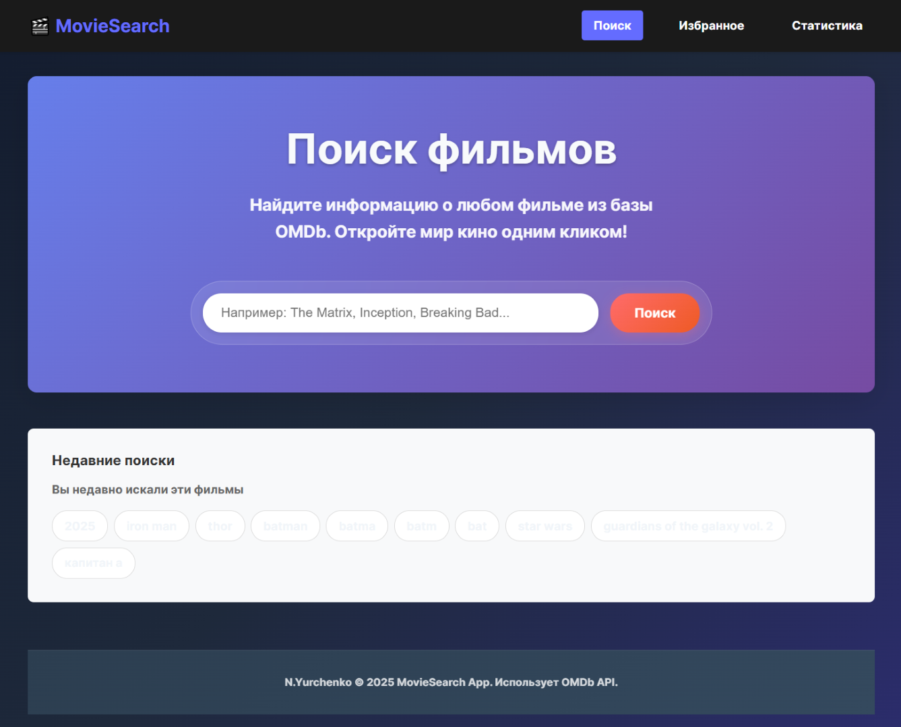
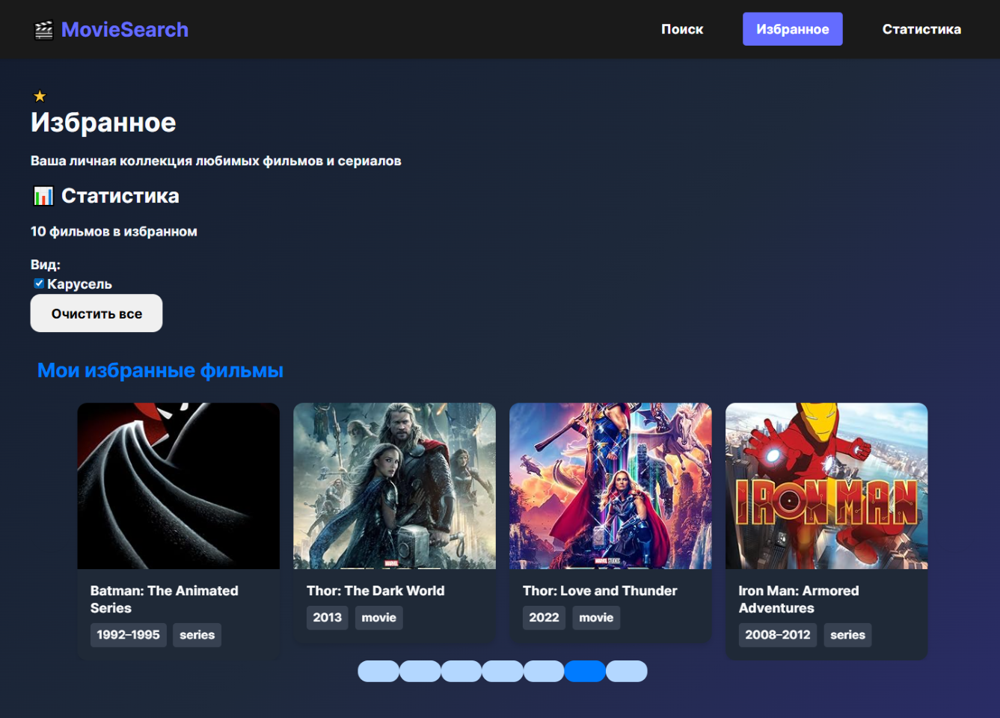
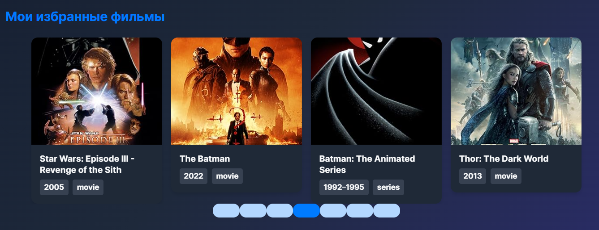
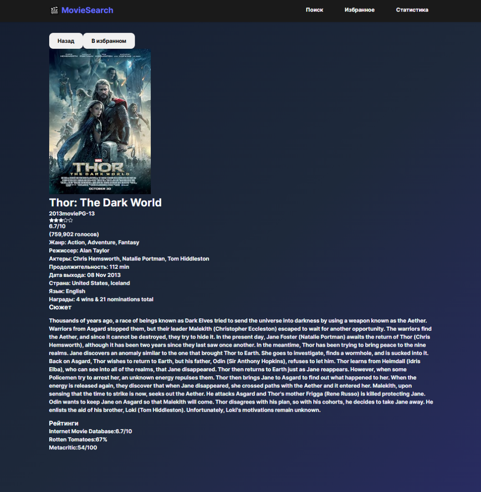
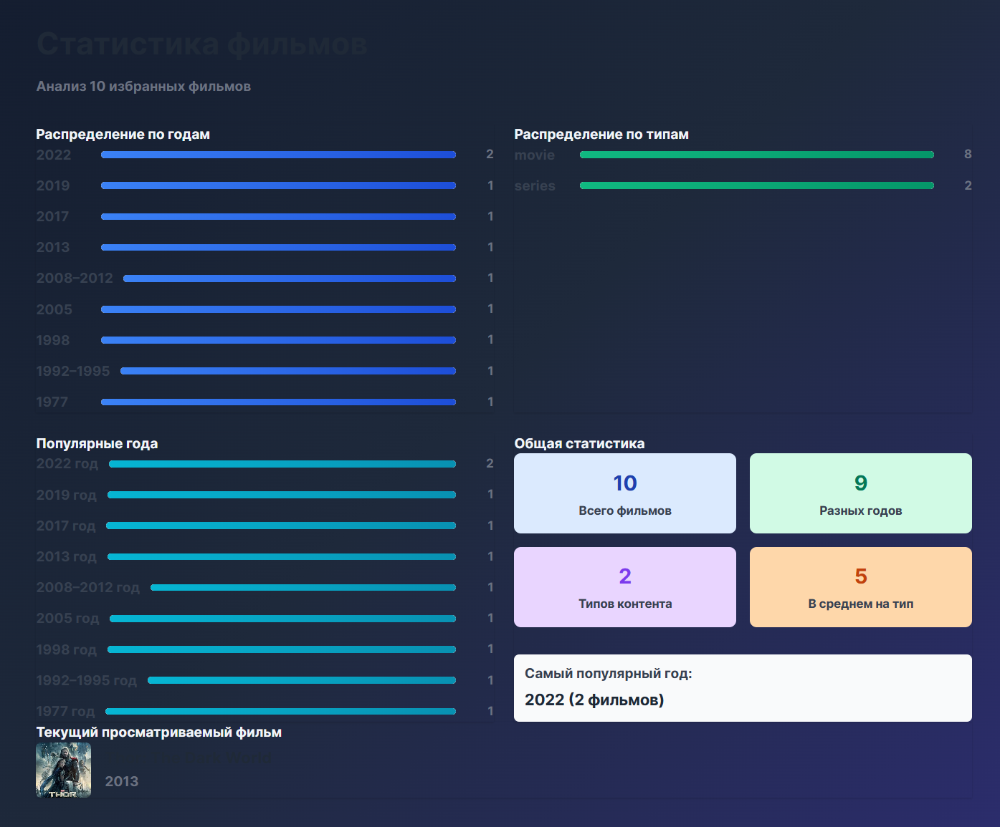
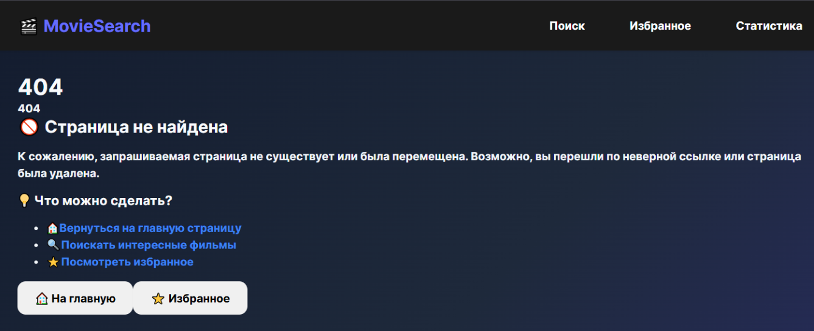

# 🎬 "Search movies by catalog 'OMDb API'"
==========================================


[deployment application](https://nmyurchenko-max.github.io/nmy-ra-toolkit/)

==========================================

Веб-приложение для поиска фильмов с использованием OMDb API. 
Построено на React, TypeScript и Redux Toolkit с использованием PrimeReact для UI компонентов.

## ✨ Особенности

###  🔍 **Умный поиск фильмов** 
 Интеграция с OMDb API для поиска по названию и тегу 


### ⭐ **Управление избранными** 
 Добавляйте фильмы в избранное с постоянным хранением
 

### 🎠 **Карусель избранных** ('/favorites')
- Красивая карусель с автопрокруткой/ручной для просмотра любимых фильмов


###  Детальная информация о фильме  ('/movie/:id')
- Подробная информация о фильме с описанием, актерами, жанрами и рейтингом фильма переход при  нажатии на постер фильма


###  📊 Статистика фильмов
- по типам фильмы и сериалы, распределение по годам и популярности года


###  При ошибках ввода пооиска  предлагается перейти по верному пути в новый поиск, в избранное, в статистику


###  Стандартные технологии
- **Адаптивный дизайн** - Работает на всех устройствах (мобильные, планшеты, десктоп)
- **Оптимизированная производительность** - Debounce поиск, lazy loading изображений
- **State Management** - Redux Toolkit для управления состоянием приложения
- **TypeScript** - Полная типизация для лучшей разработки и поддержки
- **Документированное API** - Подробная JSDoc документация всех компонентов
- **Build Tool**: Vite

## 🚀 Быстрый старт

### Предварительные требования

- Node.js 18+ 
- Yarn 1.22+ or npm 7+
- Vite 7.0+
- TypeScript 5.0+
- PrimeReact 5.0+
- Redux Toolkit 1.8+

### Установка

1. **Клонируйте репозиторий**
   ```bash
   git clone <repository-url>
   cd nmy-ra-toolkit
   ```

2. **Установите зависимости**
   ```bash
   yarn install
   ```

3. **Готово к запуску**
   API ключ уже настроен в коде, дополнительные настройки не требуются.

4. **Запустите приложение**
   ```bash
   yarn dev
   ```

5. **Откройте браузер**
   Перейдите на `http://localhost:5173`

## 📁 Структура проекта

```
src/
├── components/                 # React компоненты
│   ├── entities/              # Бизнес-логика компоненты
│   │   ├── MovieCard/         # Карточка фильма
│   │   └── MovieList/         # Список фильмов
│   ├── layout/                # Layout компоненты
│   │   └── Layout/            # Главный layout
│   ├── pages/                 # Страницы приложения
│   │   ├── Home.tsx           # Главная страница
│   │   └── Favorites.tsx      # Страница избранных
│   └── shared/                # Переиспользуемые компоненты
│       ├── ui/                # UI компоненты
│       │   └── SearchBar.tsx  # Поисковая строка
│       └── widgets/           # Виджеты и карусели
│           ├── FavoritesCarousel.tsx  # Карусель избранных
│           └── FavoritesCarousel.css  # Стили карусели
├── hooks/                     # Кастомные React хуки
│   ├── useMovieSearch.ts      # Хук для поиска фильмов
│   └── useFavorites.ts        # Хук для управления избранными
├── redux/                     # Redux store и slices
│   ├── slices/                # Redux slices
│   │   ├── moviesSlice.ts     # Состояние фильмов
│   │   ├── favoritesSlice.ts  # Состояние избранных
│   │   └── searchSlice.ts     # Состояние поиска
│   └── store/                 # Конфигурация store
│       └── store.ts           # Redux store
├── services/                  # Сервисы и API
│   ├── api/                   # API сервисы
│   │   └── omdbApi.ts         # OMDb API интеграция
│   └── types/                 # TypeScript типы
│       └── movie.ts           # Типы для фильмов
└── utils/                     # Утилиты
    └── constants.ts           # Константы приложения
```

## 📖 API Документация

### Основные компоненты

#### MovieCard
Карточка фильма с постером, информацией и кнопкой избранного.

```tsx
<MovieCard
  movie={movieData}
  isFavorite={true}
  onFavoriteToggle={(movie) => handleToggle(movie)}
  showFavoriteButton={true}
/>
```

#### MovieList
Адаптивная сетка карточек фильмов.

```tsx
<MovieList
  movies={movies}
  favorites={favoriteIds}
  onFavoriteToggle={(movie) => handleToggle(movie)}
  loading={false}
  className="custom-grid"
/>
```

#### FavoritesCarousel
Карусель для отображения избранных фильмов с автопрокруткой.

```tsx
<FavoritesCarousel
  favorites={favoriteMovies}
  onMovieClick={(movie) => navigate(`/movie/${movie.imdbID}`)}
  onRemoveFromFavorites={(movie) => removeFromFavorites(movie)}
  autoplay={true}
  autoplayInterval={4000}
/>
```

#### SearchBar
Поисковая строка с debounce и валидацией.

```tsx
<SearchBar
  onSearch={(query) => handleSearch(query)}
  onClear={() => clearResults()}
  placeholder="Поиск фильмов..."
  loading={isLoading}
/>
```

### Кастомные хуки

#### useMovieSearch
Хук для поиска фильмов с пагинацией.

```tsx
const {
  movies,
  currentMovie,
  loading,
  error,
  searchMovies,
  loadMoreMovies,
  clearSearch
} = useMovieSearch();
```

#### useFavorites
Хук для управления избранными фильмами.

```tsx
const {
  favorites,
  addToFavorites,
  removeFromFavorites,
  toggleFavorite,
  isFavorite
} = useFavorites();
```

## 🔧 Конфигурация

### Константы приложения
Файл `src/utils/constants.ts` содержит все конфигурационные константы:

```typescript
export const OMDB_API_KEYS = [Ваш личный API ключ];
// мой тестовый ключ, согласован к использованию и зашит в код
export const OMDB_BASE_URL = 'https://www.omdbapi.com';
export const MIN_SEARCH_LENGTH = 3;
export const SEARCH_DEBOUNCE_DELAY = 500;
```

### Redux Store
Настроен с redux-persist для постоянного хранения избранных фильмов:

```typescript
// src/redux/store/store.ts
import { configureStore } from '@reduxjs/toolkit';
import { persistStore, persistReducer } from 'redux-persist';

const store = configureStore({
  reducer: {
    movies: moviesReducer,
    favorites: persistReducer(persistConfig, favoritesReducer),
    search: searchReducer,
  },
});
```

### Сборка для продакшена
```bash
yarn build
```

### Запуск для разработки
```bash
yarn dev
```

## 👤 Автор
 
**N.Yurchenko**

[LICENSE](LICENSE)

- Email: [NMYurchenko@outlook.com](mailto:NMYurchenko@outlook.com),
  [Yurch-nina@yandex.ru](mailto:yurch-nina@yandex.ru)

- Telegram: [@NMYurchenko](https://t.me/NMYurchenko)
- WattsApp: [+79851604167](https://wa.me/79851604167)
- Max: [+79851604167](https://web.max.ru/79851604167)

- GitHub: [NMYurchenko-max](https://github.com/NMYurchenko-max)

## 🙏 Благодарности

- [OMDb API](http://www.omdbapi.com/) за предоставление данных о фильмах
- [Netogy](https://netology.ru/) за программу обучения FullStack разработчика

## План доработки

- [ ] Добавить поиск по актерам и жанрам
- [ ] Добавить переход из статистики в фильмы

---

⭐ **Если вам понравилось это приложение, поставьте звезду на GitHub!**
